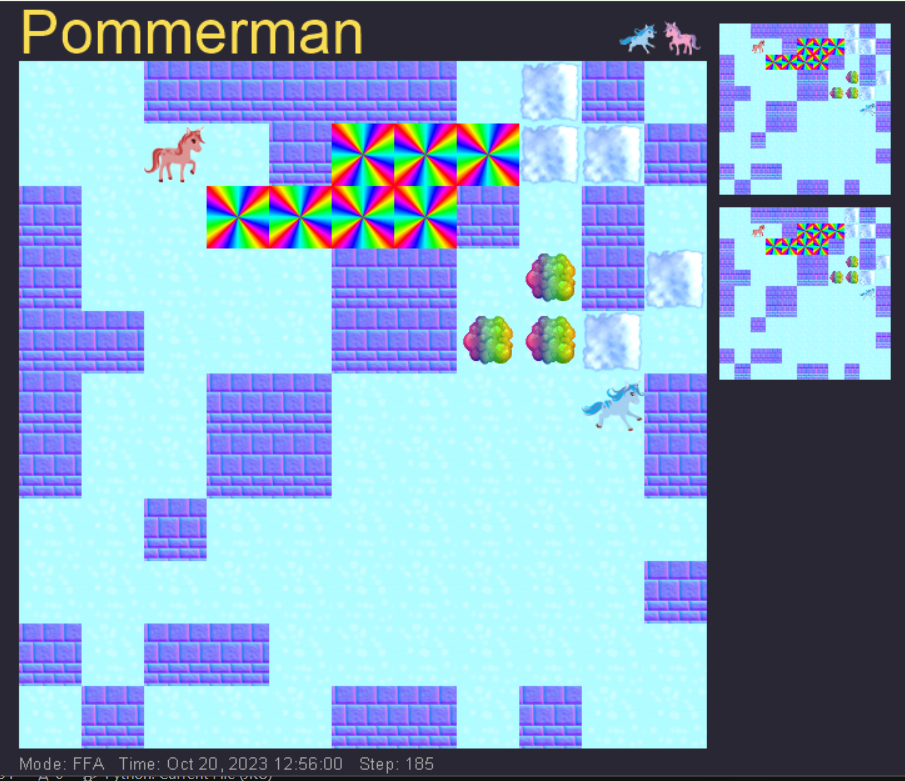

# XAI Pommerman data generation

This repository includes data about duels of different algorithms in Pommerman game as well as the code with which this data was collected.

***Pommerman***: *Board game for algorithm competitions. Its rules have many versions but in out instance, there are two agents moving on the 11 x 11 board who can place a ticking bombs on the board and try to kill their opponents. The game is also spiced by some minor fetures like collecting items which increase agents ammo or blast range of his bombs, ability of agents to kick bombs on some occassions and destroyability of some impassable tiles.*

To most important file of this repository is the table *game_records.csv* which includes records of each step of in total 81 pommerman games.

The columns of the file are as follows:

*  **game_id** ... identificator of the game 
* **step** ... step of the game. Necessary to order states of each game.
* **player1_class** ... algorithm operating with agent 1
* **player2_class** ... algorithm operating with agent 2
* **player**(1/2)**_**(row/col) ... x and y position of agents at the given state
* **board_...** ... 121 columns describing game board at the given state
* **bomb_blast_strength_** ... 121 columns describing, which fields of the map contains bombs and what will be the blast_strength of these bombs
* **bomb_blast_strength_** ... 121 columns describing, which fields of the map contains bombs and when will those bombs explode
* **flame_life_*** 121 columns describing which fields of the board are currently on fire and how long it will last

There were 3 algorithms used:

* **reflex** ... reflex agents was choosing its actions based on precoded rules.
* **monte_carlo** ...  heuristic monte-carlo search agent
* **baby_deep_q** ... this agent had access to a DQN which decided, which actions he should perform. It was, however, not trained long enough to make him competitive.

The algorithms themselves are stored in folder *agents*.

In case you would like to reproduce this repository, you can use the file *pommerman.yml* which includes neccessary conda dependencies a settings. However, I am afraid that it still won't work, because the original repository used some not-generally-accessible packages which we were provided by the instructors from a different excercise. I think that it would be quite some work to decide, which of the files provided by them are instrumental to running simulation game. If you want me to do it, please ask, but if you are happy with the data provided, then the full reproducibility maybe is not neccesary.  

